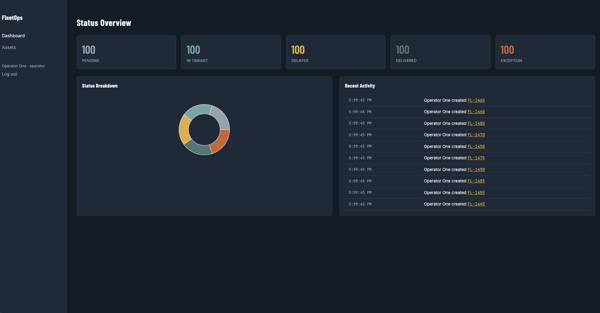
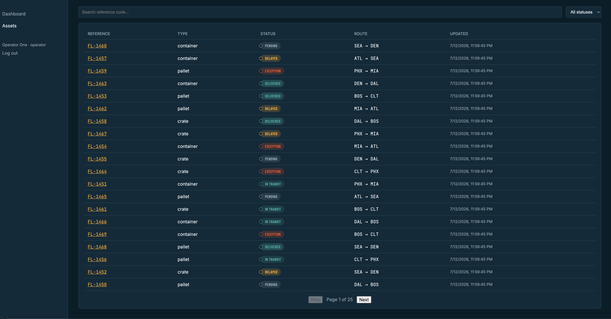

# FleetOps Console

A MERN + TypeScript operations console for tracking assets through a status lifecycle that I built based off the system used at my current job. Scoped and modeled from a discovery phase before any code was written, with the design artifacts (sitemap, wireframes, design system) checked in alongside the code that implements them.

**Stack:** React 18 + TypeScript + Vite · Node + Express + TypeScript · MongoDB/Mongoose · JWT auth with rotating refresh tokens · Docker Compose · GitHub Actions CI

## The problem

Operations teams tracking assets or shipments need a single place to see status at a glance, drill into any one unit's history, and act on exceptions before they become customer-facing problems. See [`docs/01-discovery.md`](docs/01-discovery.md) for the full problem statement, roles, and scope fence.

## Process

This project was built in four phases, documented as it went rather than reconstructed after the fact:

1. **Discovery** — [`docs/01-discovery.md`](docs/01-discovery.md): problem statement, roles, entities, explicit scope fence
2. **Design** — [`docs/02-sitemap.md`](docs/02-sitemap.md), [`docs/03-wireframes.md`](docs/03-wireframes.md), [`docs/04-design-system.md`](docs/04-design-system.md): sitemap, user flows, low-fi wireframes, and a named design system (palette, type, spacing, a signature UI element) written before any UI code
3. **Backend** — auth, RBAC, CRUD, audit logging, tests (`server/`)
4. **Frontend + hardening** — UI built against the Phase 1 mockups, plus a short security review ([`docs/06-security.md`](docs/06-security.md)) and CI

Full week-by-week plan: [`PHASED_BUILD_PLAN.md`](PHASED_BUILD_PLAN.md).

## Architecture

See [`docs/05-architecture.md`](docs/05-architecture.md) for the full write-up, including why MongoDB was chosen over SQL here and what trade-offs that implies.

```
client (React/TS) --fetch--> server (Express/TS)
                                  |
                          auth -> rbac -> validate (Zod)
                                  |
                              controller
                                  |
                          Mongoose -> MongoDB
                                  |
                         AuditLog write on every mutation
```

## Key features

- JWT auth with rotating, hashed refresh tokens (httpOnly cookies)
- Role-based access control (admin / operator / viewer), enforced server-side only
- Asset lifecycle tracking with a full append-only audit trail
- User management: admins can list users and change roles, with a guard against demoting the last remaining admin
- Dashboard with live status breakdown and a recent activity feed
- Server-side search, filter, and pagination over a seeded 500-record dataset
- Rate limiting on auth routes, Zod validation on every mutating request
- CI pipeline: lint, build, test, and `npm audit` on every push

## Screenshots

**Dashboard** — status overview, breakdown chart, recent activity feed



**Assets** — searchable, filterable, paginated list over the seeded 500-record dataset



*(Asset detail and Admin Users screenshots to come.)*

## Running locally

Requires [Docker Desktop](https://www.docker.com/products/docker-desktop/) running.

**Quickest path** — one script handles env setup, build, start, and seeding:

```bash
git clone https://github.com/<your-username>/fleetops-console.git
cd fleetops-console
chmod +x setup.sh
./setup.sh
```

It creates `server/.env` with fresh random JWT secrets if one doesn't exist yet, tears down any previous containers/volumes, builds and starts everything in the background, waits for the API to respond, then seeds the database. Takes about a minute on first run.

**Manual path**, if you'd rather see/control each step:

```bash
git clone https://github.com/<your-username>/fleetops-console.git
cd fleetops-console
cp server/.env.example server/.env   # then fill in two real JWT secrets, e.g. via `openssl rand -hex 32`
docker compose up --build
```

Then, in a second terminal, seed the database — run this *inside* the api container so it resolves the `mongo` hostname correctly:

```bash
docker compose exec api node dist/scripts/seed.js
```

- Client: http://localhost:5173
- API: http://localhost:4000

Seeded logins (password `password123` for all three):

| Role | Email |
|---|---|
| Admin | admin@fleetops.dev |
| Operator | operator@fleetops.dev |
| Viewer | viewer@fleetops.dev |

## Testing

```bash
cd server && npm test
```

`server/src/tests/auth.test.ts` demonstrates the Supertest pattern used across the API; it's a template, not full coverage — the CI workflow runs it against a real MongoDB service container on every push.

## What I'd do with more time

- Websocket-based live updates instead of polling for the activity feed
- Per-region/per-team scoping on top of the current flat role model
- Soft-delete on assets so removed records don't disappear from history
- Full CRUD (not just role changes) on the Admin Users page — invite/deactivate users, not just reassign roles

See [`docs/05-architecture.md`](docs/05-architecture.md) and [`docs/06-security.md`](docs/06-security.md) for the fuller list of trade-offs and gaps.

## License

MIT
